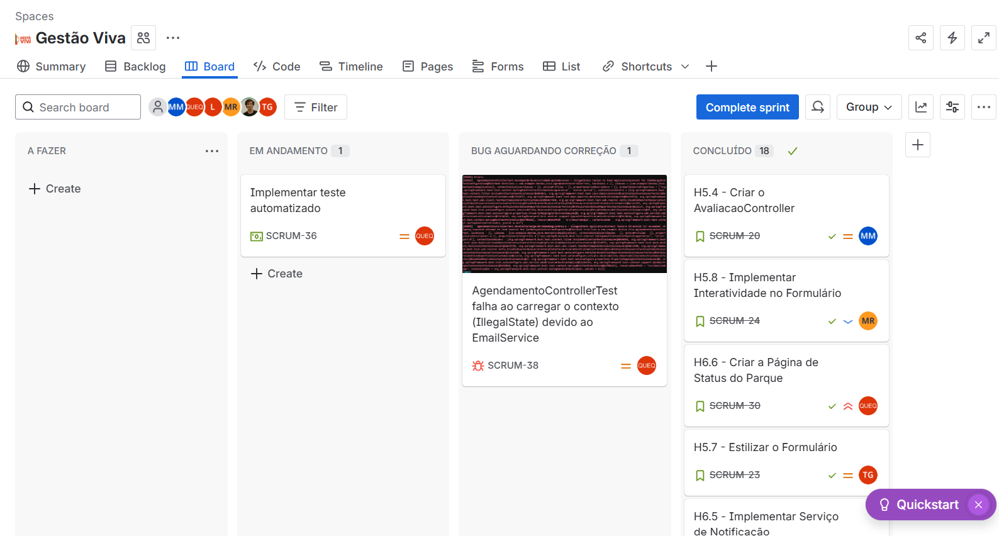

# ⛯ Gestão Viva

---

## 🎯 Descrição do projeto:
**Gestão Viva** é uma plataforma voltada à gestão da experiência do visitante ao parque de esculturas Francisco Brennand.
Nosso objetivo é ser a ponte digital oficial entre o parque e o público visitante, organizando o fluxo de visitação e coletando dados paa aprimorar a organização e experiência.  

**A ferramanta é, acima de tudo, sobre gestão, comunicação e inteligência**.

---

## 👥 Nossa Equipe:
| Nome             | Funções | Hobby                                                                 | Contato |
|------------------|---------|-----------------------------------------------------------------------|---------|
| Matheus Melquiades |Scrum Master| Jogar videogame, ler quadrinhos e ir ao cinema.                      | mmn3@cesar.school     |
| Luiz Felipe      |Project Owner| Jogar videogame, cozinhar e jogar vôlei.                             | lfmf@cesar.school      |
| Gustavo Rodrigues|Quality Assurance (QA)| Escutar música, ir à academia e andar de bicicleta.                  | grq@cesar.school     |
| Jorge Tadeu      |Desenvolverdor Front End| Ir à academia e jogar vôlei.                                         |jtgsf@cesar.school     |
| Maria Júlia      |Desenvolverdor Front End| Desenhar (papel e digital, ainda aprendendo), ler e assistir sitcom. | mjmr@cesar.school     |
| Maria Eduarda    |Desenvolverdor Back End| Escutar música, jogar videogame, pintar e desenhar.                  | merm@cesar.school    |
| André Ferraz     |Desenvolverdor Back End| Surfar, ir à academia, jogar basquete e acompanhar outros esportes.  |afg@cesar.school     |

---

## 🔗 Informações Gerais:

Link para o [Google Sites](https://sites.google.com/cesar.school/recentro/p%C3%A1gina-inicial).

Link para o [Drive](https://drive.google.com/drive/folders/1U2QRjp5EYA9rwZE-oSNO-anGpi1oldjQ?usp=sharing).

**[Clique aqui para ver a documentação completa dos testes](./TESTES_AUTOMATIZADOS.md)**

---

## 1️⃣ Entrega 1 (10/09/2025):

### História 1 - Pré-Cadastramento de Grupos Maiores:
[Documento](https://docs.google.com/document/d/1O3XCBSFGcOWAzO02Hj76zTlmjclowfFLRUYRtmHPWO8/edit?usp=sharing).

**Protótipo e ScreenCast:**

Link para o [Screencast](https://www.youtube.com/watch?v=f4ef26sK7CI).

### História 2 - DashBoard de Visualização:
[Documento](https://docs.google.com/document/d/1OJyBRyiua2FPd069q5BTnX6WAjHapRpxr8jQKkxNM3A/edit?usp=sharing).

**Protótipo e ScreenCast:**

### História 3 - Mostrar Visitantes Cadastrados:
[Documento](https://docs.google.com/document/d/1Z_QucY-Nkrokc6nyTHMMWR_MUT6pEuJd4XxVFVaHzQ4/edit?usp=sharing).

**Protótipo e ScreenCast:**

Link para o [Screencast](https://www.youtube.com/watch?v=dLB7TWmaRHs).

.png)

### História 4 - Controle de Entrada dos Visitantes:
[Documento](https://docs.google.com/document/d/1HQafALj0o4WjCAEuzkAeYNgiezR8xqphJeWFZoc57xI/edit?usp=sharing).

**Protótipo e ScreenCast:**

Link para o [Screencast](https://www.youtube.com/watch?v=xna3af7nVCw).

### História 5 - Pesquisa de Satisfação:
[Documento](https://docs.google.com/document/d/1-XJaAeeuDCQdH_Fsa_rVDQV3C8qHujb6l_nacyLILQA/edit?usp=sharing).

**Protótipo e ScreenCast:**

Link para o [Screencast](https://www.youtube.com/watch?v=hhRS00EjV1c).

### História 6 - Notificações de Mudanças Pelo Clima:
[Documento](https://docs.google.com/document/d/1Bg07OvdYBB-QY06ng9sI0KQ6aVSMsELCKXf1Mgg0r5w/edit?usp=sharing).

**Protótipo e ScreenCast:**

Link para o [Screencast](https://www.youtube.com/watch?v=zK_en4-oZKM)

### História 7 - Acessibilidade no Parque das Esculturas:
[Documento](https://docs.google.com/document/d/1f5ztoESUGCJT14r35-CQPm30vOouCAfoKymkx7YnDwo/edit?usp=sharing).

## 2️⃣ Entrega 2 (30/09/2025):

**Ambiente de Versionamento de código atualizado semanalmente:**
**Protótipo de Histórias:**
**BugTracker no Jira:**

---

## 3️⃣ Entrega 3 (23/10/2025):
**BugTracker no Jira:**

**Wireframes:**
### História 5: Pesquisa de Satisfação

### História 6: Notificações de Mudanças Climáticas

### Testes automatizados: Cypress e Rest Assured
Rest Assured: 
Cypress:  

---
